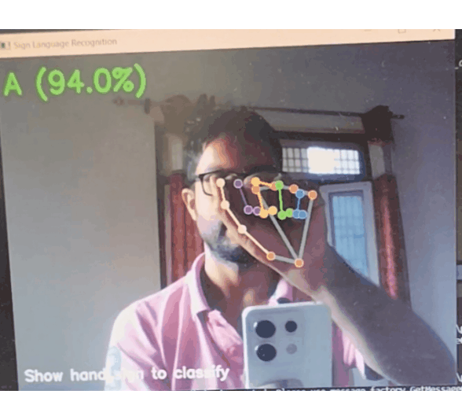

# Sign Language Recognition System

A real-time sign language recognition system using Python, OpenCV, MediaPipe, and scikit-learn. This project captures hand signs via webcam, processes them to extract hand landmarks, and classifies them as A, B, or C using a trained machine learning model.

## Demo


## Features
- Real-time hand sign recognition using webcam
- Uses MediaPipe for hand landmark detection
- Trains a Random Forest classifier on custom hand sign data
- Easy to extend for more sign classes
- User-friendly interface with live prediction and confidence score


## Project Structure
```
 collect_imgs.py                # Script to collect hand sign images
 prepare_dataset_from_images.py # Extracts hand landmarks and prepares dataset
 train.classifier.py            # Trains the classifier
 test_live.py                   # Real-time sign recognition via webcam
 requirements.txt               # Python dependencies
 data/                          # Collected images (by class)
 data.pickle                    # Processed dataset
 model.p                        # Trained model
 README.md                      # Project documentation
```

## Setup Instructions

1. **Clone the repository**
   ```sh
   git clone https://github.com/ABHINAV1111-WEB/SignLanguage
   cd sign-language-recognition
   ```

2. **Create and activate a virtual environment**
   ```sh
   python -m venv venv
   # On Windows PowerShell:
   .\venv\Scripts\Activate.ps1
   # On Windows CMD:
   .\venv\Scripts\activate.bat
   ```

3. **Install dependencies**
   ```sh
   pip install -r requirements.txt
   ```

## Usage

### 1. Collect Images
Run the script and follow the prompts to collect images for each sign class:
```sh
python collect_imgs.py
```

### 2. Prepare the Dataset
Extract hand landmarks and create the dataset:
```sh
python prepare_dataset_from_images.py
```

### 3. Train the Classifier
Train the model on your collected data:
```sh
python train.classifier.py
```

### 4. Run Real-Time Recognition
Start the live sign language recognition system:
```sh
python test_live.py
```
Show your hand signs (A, B, C) to the webcam and see the predictions!

## Customization
- To add more signs, update the scripts and collect more data for new classes.
- Update `labels_dict` in `test_live.py` to match your new classes.

## Requirements
- Python 3.11+
- OpenCV
- MediaPipe
- scikit-learn
- numpy

Install all dependencies with:
```sh
pip install -r requirements.txt
```

## Credits
- [MediaPipe](https://mediapipe.dev/) for hand tracking
- [OpenCV](https://opencv.org/) for image processing
- [scikit-learn](https://scikit-learn.org/) for machine learning

## License
This project is for educational purposes. Feel free to use and modify it for your own learning and portfolio!

## Author:
Abhinav Singh Kushawaha: Enthusiast learner
